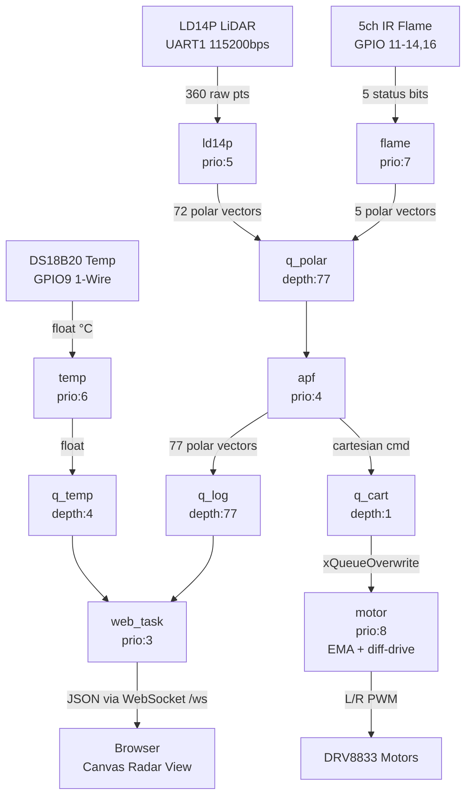

# ESP32 Fire-Fighting Robot — RTOS Sensor Fusion & APF Navigation

基于 ESP32-S3 的智能消防巡检机器人嵌入式系统。多源异构传感器（LiDAR + 红外火焰 + 温度）通过 FreeRTOS 事件组同步融合，经嵌入式人工势场法 (APF) 实时解算避障指令，并通过板载 Web 页面 + WebSocket 提供雷达可视化。

## 硬件平台

| 组件 | 型号 | 接口 |
|---|---|---|
| 主控 | ESP32-S3 (16MB Flash, 8MB Octal PSRAM) | — |
| 激光雷达 | LD14P | UART1 (TX:17, RX:18), 115200bps |
| 火焰传感器 | 5× IR 红外 | GPIO 11, 12, 13, 14, 16 (注意: 15 已被电机占用) |
| 温度传感器 | DS18B20 | GPIO9 (1-Wire, 需外接 4.7kΩ 上拉) |
| 电机驱动 | DRV8833 ×2 | A: GPIO5/6, B: GPIO7/15, LEDC PWM 20kHz |
| 心跳 LED | 板载 | GPIO48 |
| 通信 | Wi-Fi AP (APF-NVC, 无密码) | IP 192.168.1.1, HTTP Port 80 |

## 项目结构

```
ESP32_Template/
├── src/
│   ├── main.c                    # 入口 — 系统/驱动/队列/任务创建编排
│   ├── sys_init.c                # ESP32 系统级初始化 (NVS / SPIFFS / Wi-Fi AP)
│   ├── CMakeLists.txt            # 源文件自动发现 + 组件依赖
│   ├── drivers/
│   │   ├── ds18b20.c             # DS18B20 1-Wire 底层驱动 (GPIO 位操作 + CRC8)
│   │   ├── ld14p.c               # LD14P UART 协议帧解析 + CRC8 校验
│   │   └── drv8833.c             # DRV8833 LEDC PWM 输出 + 制动
│   └── tasks/
│       ├── web_task.c            # HTTP 文件服务 (SPIFFS) + WebSocket JSON 推送
│       ├── lidar_task.c          # LiDAR 数据采集 + 360→72 降采样
│       ├── flame_task.c          # 5 路火焰检测 + 极坐标映射
│       ├── temp_task.c           # DS18B20 周期采样 (4Hz)
│       ├── apf_task.c            # 人工势场法避障解算
│       └── motor_task.c          # EMA 平滑 + 差速 PWM 控制
├── include/
│   ├── apf_common.h              # 全局类型/宏定义/RTOS 句柄 extern 声明
│   ├── sys_init.h                # 系统初始化接口 (NVS / SPIFFS / Wi-Fi AP)
│   ├── drivers/                  # 驱动头文件
│   └── tasks/                    # 任务头文件
├── data/
│   ├── index.html                # 板载雷达可视化网页 (Canvas 极坐标图)
│   ├── script.js                 # WebSocket 客户端 + Canvas 渲染逻辑
│   └── style.css                 # 深色主题样式
├── platformio.ini                # PlatformIO 构建配置
├── sdkconfig.defaults            # ESP-IDF SDK 覆盖配置
├── default_16MB.csv              # 分区表 (factory + OTA×2 + SPIFFS 1MB)
└── docs/                         # 数据手册与设计文档
```

## RTOS 任务表

| 任务名 | 优先级 | 栈 (words) | 周期 | 功能 |
|---|---|---|---|---|
| `LedTask` | 1 | 2048 | 1Hz | 心跳 LED 翻转 |
| `web_task` | 3 | 8192 | 事件驱动 | HTTP 服务器 + SPIFFS 文件服务 + WebSocket JSON 推送 |
| `apf` | 4 | 4096 | ~4Hz | 人工势场解算: 引力+斥力→合力→q_cart |
| `ld14p` | 5 | 8192 | 事件驱动 | UART 读帧, CRC8 校验, 360→72 降采样 |
| `temp` | 6 | 4096 | 4Hz | DS18B20 温度采集 |
| `flame` | 7 | 2048 | 4Hz | 5 路红外火焰状态检测 |
| `motor` | 8 | 4096 | 8Hz | EMA 平滑 + 差速分解 + PWM 输出 |

## 任务间通信对象

### 队列

| 队列 | 深度 | 元素类型 | 生产者 → 消费者 |
|---|---|---|---|
| `q_polar` | 77 | `vector_polar_t` | LiDAR(72) + Flame(5) → APF |
| `q_cart` | 1 | `vector_cart_t` | APF → Motor (xQueueOverwrite) |
| `q_temp` | 4 | `float` | DS18B20 → web_task |
| `q_log` | 77 | `vector_polar_t` | APF → web_task |

### 事件组 `eg_sync`

| 事件位 | 置位者 | 清除者 | 含义 |
|---|---|---|---|
| `BIT_LIDAR_Q_READY` | lidar_task | apf_task | q_polar 有新 LiDAR 数据 |
| `BIT_TEMP_Q_READY` | temp_task | web_task | q_temp 有新温度数据 |
| `BIT_FLAME_Q_READY` | flame_task | apf_task | q_polar 有新火焰数据 |
| `BIT_LOG_Q_READY` | apf_task | web_task | q_log 有新一帧日志数据 |

## 数据流向



## 网页雷达可视化

ESP32 内置 Web 服务器，连接其 Wi-Fi (`APF-NVC`) 后浏览器访问 `http://192.168.1.1` 即可看到实时雷达图:

- **Canvas 极坐标渲染** — 零外部依赖，纯前端实现
- 同心圆距离网格 (1m~6m, 危险区/安全区分色)
- 旋转扫描线动画
- 散点着色: 红色 <1m (危险), 绿色 1~6m (安全), 青色 >6m
- 实时温度显示 + 危险/安全点统计

网页由 ESP32 的 SPIFFS 分区提供 (`data/` 目录), 通过 WebSocket (`ws://192.168.1.1:80/ws`) 接收 JSON 数据流。

## WebSocket 数据格式

JSON 帧结构 (cJSON 序列化, 每帧 ~2.5KB):

```json
{
  "ts": 1234567890,
  "temp": 25.50,
  "vectors": [
    {"a": 2.5, "d": 1234.5},
    {"a": 7.5, "d": 2345.6},
    ...
    {"a": 357.5, "d": 4567.8}
  ]
}
```

- `ts`: esp_timer_get_time() 微秒时间戳
- `temp`: 温度值 (°C)，无数据时为 `NaN`
- `vectors`: 77 个极坐标点 `{angle_deg, distance_mm}` (72 LiDAR + 5 Flame)

## 构建与烧录

```bash
# 仅编译项目（生成.pio/build/<环境名>/目录）
pio run

# 编译并烧录固件
pio run -t upload

# 编译 data/ 目录内文件（SPIFFS）为分区镜像
pio run -t buildfs

# 编译分区镜像并上传
pio run -t uploadfs

# 串口监视，若固件缺失则打包
pio run -t monitor

# 清理
pio run -t clean

# 查看已解析的构建变量
pio run -t envdump
```

构建、烧录固件+网页、烧录一条龙（Build + Build File system Image + Upload Filesystem Image + Upload and Monitor）:

```
pio run -t upload -t uploadfs -t monitor
```

> 烧录波特率 921600，监视器波特率 115200（见 `platformio.ini`）。

### DEBUG 模式

在 `apf_common.h` 中取消注释 `#define DEBUG`（或通过 `build_flags = -D DEBUG`），系统将跳过所有传感器与控制任务，仅执行电机 ramp 测试序列。生产运行时务必禁用。

## SDK 关键配置 (`sdkconfig.defaults`)

| 配置项 | 值 | 说明 |
|---|---|---|
| `CONFIG_SPIRAM_MODE_OCT` | y | 启用 Octal PSRAM（N16R8 必须） |
| `CONFIG_SPIRAM_ALLOW_STACK_EXTERNAL_MEMORY` | n | 任务栈保留在内部 RAM，避免 PSRAM 缓存错误 |
| `CONFIG_FREERTOS_USE_TICKLESS_IDLE` | n | 禁止 Tickless Idle（否则 `vTaskDelay` 永不返回） |
| `CONFIG_HTTPD_WS_SUPPORT` | y | 启用 HTTPD WebSocket 支持 |
| `CONFIG_MBEDTLS_CERTIFICATE_BUNDLE` | n | 禁用证书包（避免 x509_crt_bundle 编译错误） |

## 分区表 (`default_16MB.csv`)

| 分区名 | 大小 | 说明 |
|---|---|---|
| factory | 2MB | 出厂固件 |
| ota_0 / ota_1 | 各 2MB | OTA 双分区 |
| spiffs | 1MB | Web 页面存储 |

## 关键设计决策

- **双频率解耦**: APF 势场解算 ~4Hz, 电机控制 8Hz, 通过 EMA 平滑 (τ=150ms) 消除帧间抖动
- **无锁同步**: FreeRTOS 事件组 + 队列完成所有任务间通信, 无共享内存竞争
- **极坐标统一**: LiDAR 72 扇区 + 火焰 5 虚拟点均以 `(angle_deg, distance_mm)` 极坐标表示, APF 算法输入为 77 维齐次向量
- **日志无阻塞**: Web 任务仅等 BIT_LOG_Q_READY, 温度非阻塞取最新值, 确保雷达数据流不因低速传感器卡顿
- **板载 Web 可视化**: Canvas 2D API 实现极坐标雷达图, 无任何 CDN 依赖, 13KB 文件通过 SPIFFS 部署在 ESP32 上
- **Wi-Fi AP 模式**: 开放热点, 无需外部路由器, 任何设备连接后即可打开网页查看雷达
