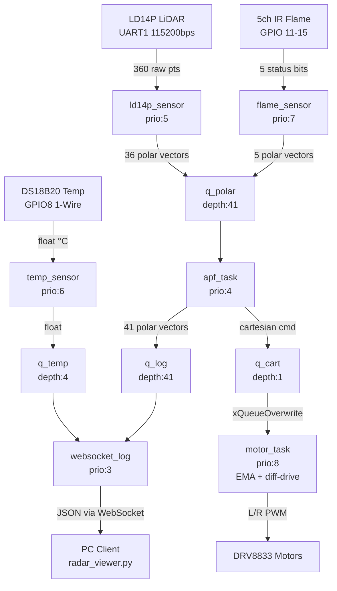
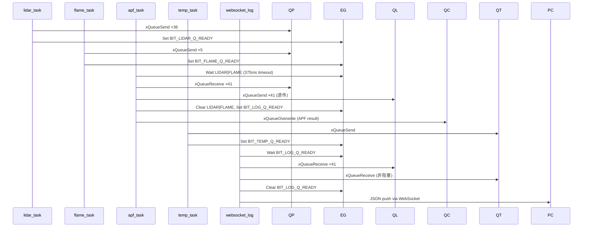

# ESP32 Fire-Fighting Robot — RTOS Sensor Fusion & APF Navigation

基于 ESP32-S3 的智能消防巡检机器人嵌入式系统。多源异构传感器（LiDAR + 红外火焰 + 温度）通过 FreeRTOS 事件组同步融合，经嵌入式人工势场法 (APF) 实时解算避障指令，并通过 WebSocket 将场景数据推送至 PC 端进行可视化建模。

## 硬件平台

| 组件 | 型号 | 接口 |
|---|---|---|
| 主控 | ESP32-S3 (16MB Flash, 8MB Octal PSRAM) | — |
| 激光雷达 | LD14P | UART1 (TX:17, RX:18), 115200bps |
| 火焰传感器 | 5× IR 红外 | GPIO 11, 12, 13, 14, 15 |
| 温度传感器 | DS18B20 | GPIO8 (1-Wire) |
| 电机驱动 | DRV8833 ×2 | GPIO4/5 (左), GPIO6/7 (右), LEDC PWM |
| 心跳 LED | 板载 | GPIO48 |
| 通信 | Wi-Fi STA + WebSocket Server | Port 81 |

## 项目结构

```
ESP32_Template/
├── src/
│   ├── main.c                    # 入口: app_main() — 硬件初始化 + 任务创建
│   ├── CMakeLists.txt            # 源文件自动发现 + 组件依赖
│   ├── drivers/
│   │   ├── ds18b20.c             # DS18B20 1-Wire 底层驱动 (GPIO 位操作)
│   │   ├── ld14p.c               # LD14P UART 协议帧解析 + CRC 校验
│   │   └── motor.c               # DRV8833 LEDC PWM 输出 + 制动
│   └── tasks/
│       ├── lidar_task.c          # LiDAR 数据采集 + 360→36 降采样
│       ├── flame_task.c          # 5 路火焰检测 + 极坐标映射
│       ├── temp_task.c           # DS18B20 周期采样
│       ├── apf_task.c            # 人工势场法避障解算
│       ├── motor_task.c          # EMA 平滑 + 差速 PWM 控制
│       ├── websocket_task.c      # WebSocket Server + cJSON 数据推送
│       └── mqtt_task.c           # [已禁用] 原 MQTT 上传
├── include/
│   ├── all_defs.h                # 全局宏定义、数据类型、RTOS 句柄 extern 声明
│   ├── drivers/                  # 驱动头文件
│   └── tasks/                    # 任务头文件
├── platformio.ini                # PlatformIO 构建配置
├── sdkconfig.defaults            # ESP-IDF SDK 覆盖配置
├── default_16MB.csv              # 分区表 (factory + OTA×2 + SPIFFS)
├── radar_viewer.py               # PC 端雷达可视化脚本
└── docs/                         # 论文文档
```

## RTOS 任务表

| 任务名 | 优先级 | 栈 (words) | 周期 | 功能 |
|---|---|---|---|---|
| `LedTask` | 1 | 2048 | 1Hz | 心跳 LED 翻转 |
| `websocket_log` | 3 | 8192 | 事件驱动 | WebSocket Server, JSON 传感器日志推送 |
| `apf_task` | 4 | 4096 | ~4Hz | APF 势场解算: 引力+斥力→合力→q_cart |
| `ld14p_sensor` | 5 | 8192 | 事件驱动 | UART 读帧, CRC 校验, 360→36 降采样 |
| `temp_sensor` | 6 | 4096 | 4Hz | DS18B20 温度采集 |
| `flame_sensor` | 7 | 2048 | 4Hz | 5 路红外火焰状态检测 |
| `motor_task` | 8 | 4096 | 8Hz | EMA 平滑 + 差速分解 + PWM 输出 *(已禁用)* |

## 任务间通信对象

### 队列

| 队列 | 深度 | 元素类型 | 生产者 → 消费者 |
|---|---|---|---|
| `q_polar` | 41 | `vector_polar_t` | LiDAR(36) + Flame(5) → APF |
| `q_cart` | 1 | `vector_cart_t` | APF → Motor (xQueueOverwrite) |
| `q_temp` | 4 | `float` | DS18B20 → WebSocket |
| `q_log` | 41 | `vector_polar_t` | APF → WebSocket |

### 事件组 `eg_sync`

| 事件位 | 置位者 | 清除者 | 含义 |
|---|---|---|---|
| `BIT_LIDAR_Q_READY` | lidar_task | apf_task | q_polar 有新 LiDAR 数据 |
| `BIT_TEMP_Q_READY` | temp_task | websocket_task | q_temp 有新温度数据 |
| `BIT_FLAME_Q_READY` | flame_task | apf_task | q_polar 有新火焰数据 |
| `BIT_LOG_Q_READY` | apf_task | websocket_task | q_log 有新一帧日志数据 |

## 数据流向



### 同步时序



## WebSocket 数据格式

JSON 帧结构 (cJSON 序列化):

```json
{
  "ts": 1234567890,
  "temp": 25.50,
  "vectors": [
    {"a": 5.0, "d": 1234.5},
    {"a": 15.0, "d": 2345.6},
    ...
    {"a": 355.0, "d": 4567.8}
  ]
}
```

- `ts`: esp_timer_get_time() 微秒时间戳
- `temp`: 温度值 (°C)，无数据时为 `NaN`
- `vectors`: 41 个极坐标点 `{angle_deg, distance_mm}`（36 LiDAR + 5 Flame）

## 构建与烧录

```bash
# 编译
pio run

# 编译 + 烧录
pio run -t upload

# 烧录 + 串口监视
pio run -t upload && pio run -t monitor

# 清理
pio run -t clean

# 单元测试
pio test
```

## PC 端雷达可视化

```bash
pip install websocket-client matplotlib numpy
python radar_viewer.py --ip <ESP32_IP> --port 81
```

或使用任意 WebSocket 客户端连接 `ws://<ESP32_IP>:81/` 接收原始 JSON 数据。

## 关键设计决策

- **双频率解耦**: APF 势场解算 ~4Hz, 电机控制 8Hz, 通过 EMA 平滑 (τ=150ms) 消除帧间抖动
- **无锁同步**: FreeRTOS 事件组 + 队列完成所有任务间通信, 无共享内存竞争
- **极坐标统一**: LiDAR 36 扇区 + 火焰 5 虚拟点均以 `(angle_deg, distance_mm)` 极坐标表示, APF 算法输入为 41 维齐次向量
- **日志无阻塞**: WebSocket 任务仅等 BIT_LOG_Q_READY, 温度非阻塞取最新值, 确保雷达数据流不因低速传感器卡顿
